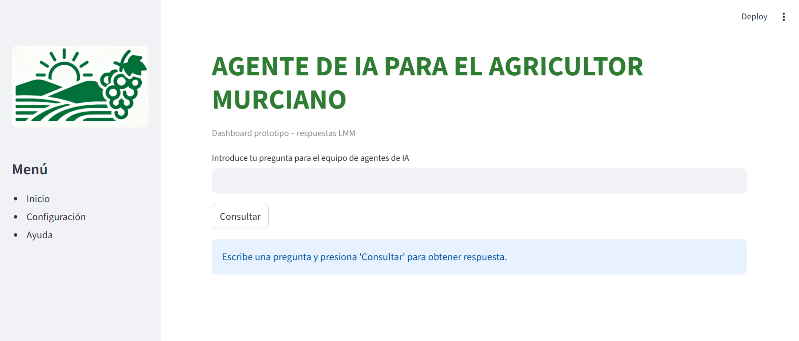
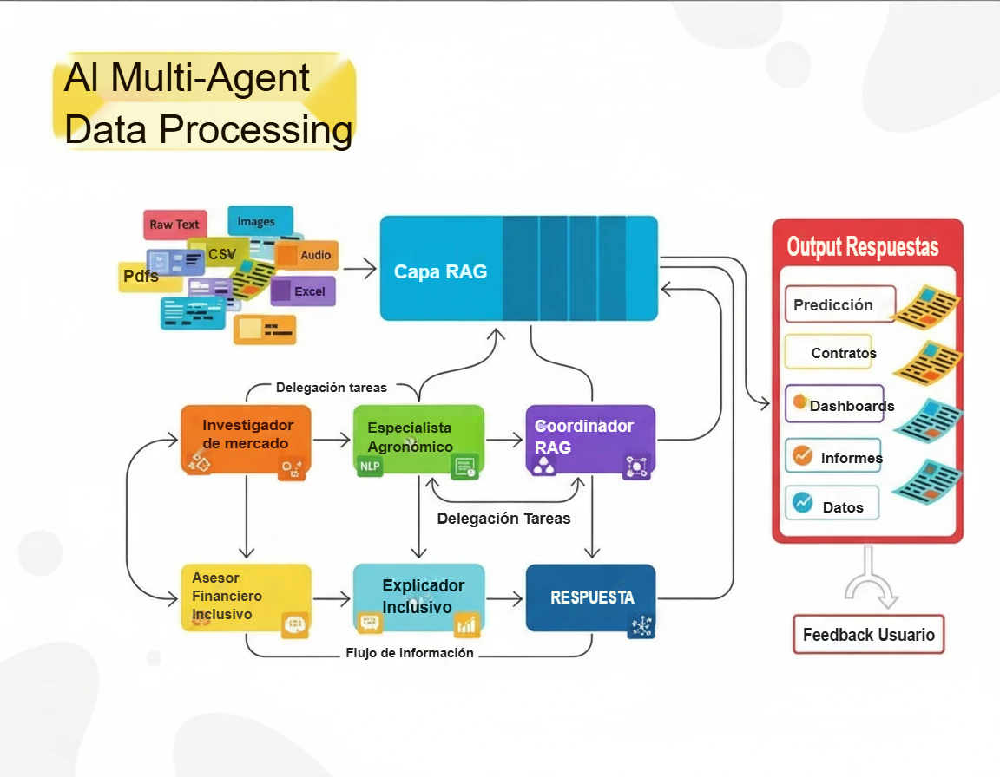
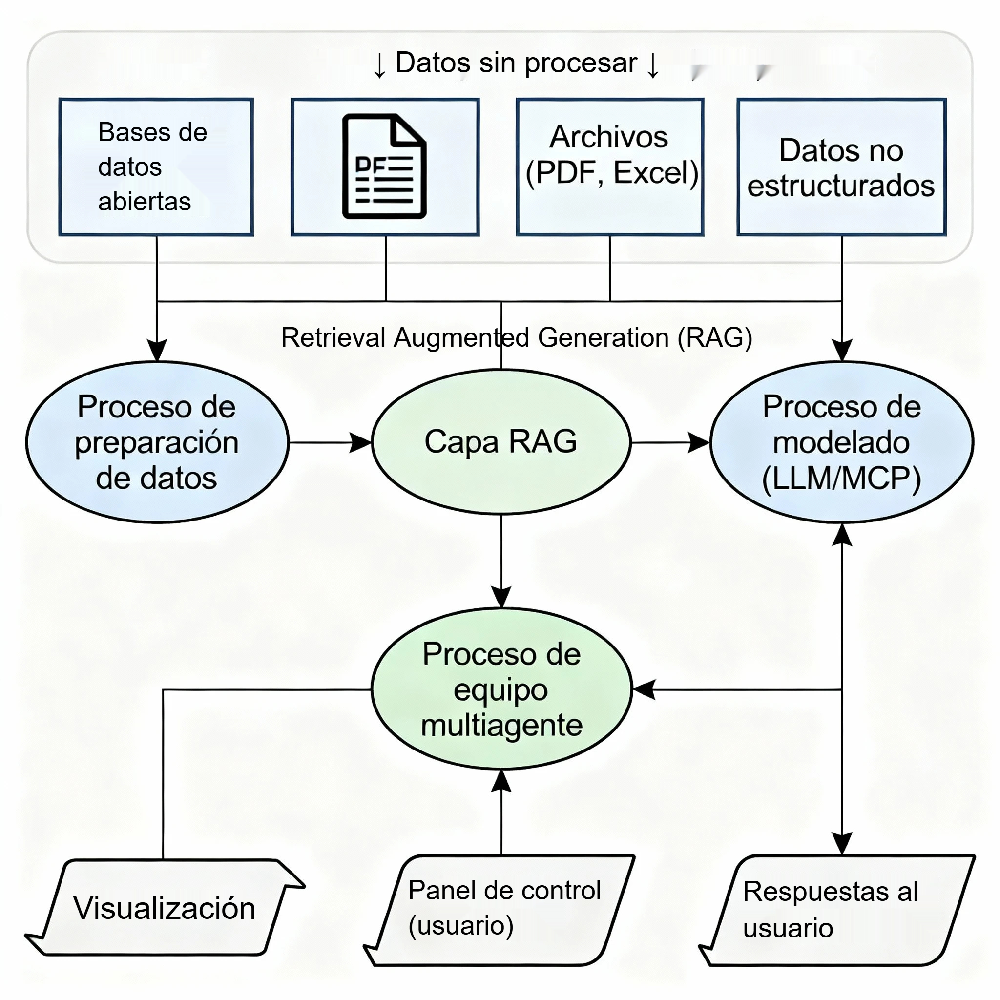
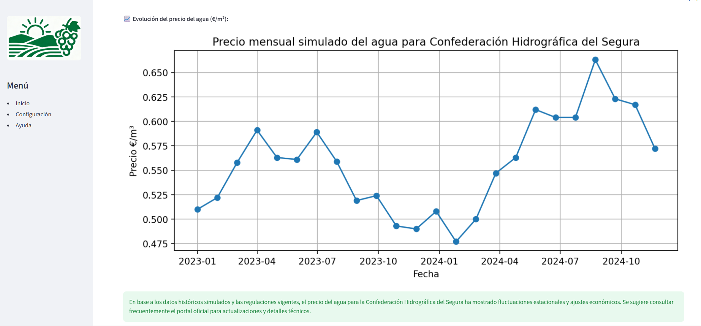
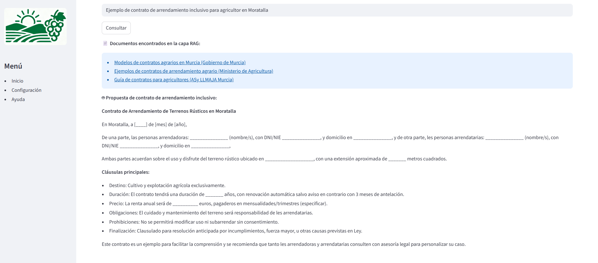
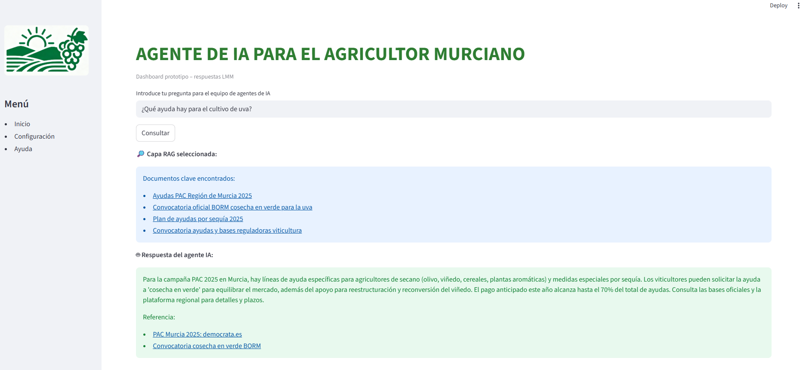
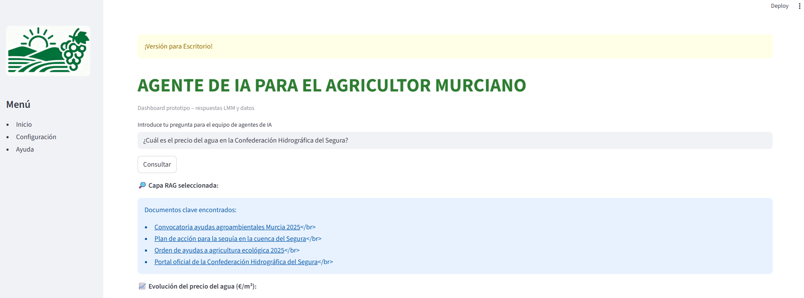

# TFM – Agente de IA para el agricultor murciano

Trabajo Fin de Máster (ENAE) centrado en el diseño de un sistema de recomendación financiera y agronómica para pequeños agricultores de la Región de Murcia, utilizando una arquitectura multi‑agente apoyada en una capa de Retrieval‑Augmented Generation (RAG).


---

## Objetivo del proyecto

El objetivo del TFM es hacer un prototipo funcional de un **agente de IA para el agricultor murciano** que:
- Responda preguntas sobre precios del agua, ayudas públicas y contratos agrarios.
- Combine conocimiento de mercado, agronomía, finanzas inclusivas y normativa.
- Presente la información en un panel sencillo, pensado para un perfil no técnico.

Ejemplo de interfaz simple (versión de escritorio):



---

## Metodología (CRISP‑DM)

Para el proyecto se ha seguido la metodología **CRISP‑DM (Cross‑Industry Standard Process for Data Mining)**, adaptada al proyecto, estructurada en seis fases: comprensión del negocio, comprensión de los datos, preparación, modelado, evaluación e implementación. [web:129][web:132]

En este TFM:

- La **capa de RAG** actúa como puente entre datos abiertos/documentos y los modelos LLM.
- El **equipo multi‑agente** se sitúa sobre esa capa para especializar las respuestas según rol.
- El **dashboard** es el punto de contacto con la persona agricultora.


---

## Arquitectura general

A nivel alto, el sistema se organiza en cuatro bloques:

1. **Fuentes de datos**: bases de datos abiertas, boletines oficiales, normativa, PDFs, Excel y datos simulados (por ejemplo, series de precio del agua).  
2. **Capa RAG**: indexa los documentos y permite recuperar contexto relevante para cada consulta.  
3. **Equipo multi‑agente**: agentes especializados (mercado, agronomía, finanzas, explicación, coordinación RAG).  
4. **Visualización**: panel Streamlit con gráficos, enlaces a documentos y respuestas generadas.




Ejemplo de módulo de simulación de precio del agua:



---

## Dos modelos de arquitectura: no encapsulado vs encapsulado

Durante el desarrollo se exploraron **dos modelos de arquitectura** para la interacción entre agentes y datos.

### 1. Modelo inicial con capa de RAG no encapsulada

En la versión preliminar, todos los agentes (Investigador de Mercado, Especialista Agronómico, Asesor Financiero Inclusivo, Explicador Inclusivo y Coordinador RAG) consultaban una **única capa RAG centralizada** y un "mini" data‑lake común.

- Ventajas: diseño sencillo, una sola canalización de RAG.
- Inconvenientes: acoplamiento alto, difícil aislar fuentes específicas por agente y controlar la trazabilidad de la información.

Con esta versión, los resultados que arrojaban a las consultas del panel de usuario eran aceptables.

Esta idea se documenta en el notebook:

- `notebooks/01_agent_hierarchy.ipynb`

Y conceptualmente se refleja en:



### 2. Modelo final con agentes encapsulados (mini data‑lakes)

En la versión refinada del proyecto, cada agente dispone de su **propio mini data‑lake y su propia cadena RAG**:

- El **Investigador de Mercado** consulta informes de precios, volatilidad y demanda.
- El **Especialista Agronómico** consulta guías de cultivos, riego y manejo del suelo.
- El **Asesor Financiero Inclusivo** consulta normativa de créditos, microfinanzas y ayudas.
- El **Coordinador RAG** consulta normativa hídrica y documentos oficiales de referencia.

La respuesta final se genera en dos pasos:

1. Cada agente responde a partir de su mini data‑lake encapsulado.
2. Un coordinador combina todas las respuestas y produce una única recomendación integrada en lenguaje claro.

Este enfoque mejora:

- El **aislamiento de responsabilidades** de cada agente.
- La **explicabilidad** (se puede rastrear qué documentos usa cada rol).
- La posibilidad de **escalar** añadiendo nuevos agentes y colecciones de documentos.

Esta arquitectura se muestra en:

- `notebooks/01_agent_hierarchy_encapsulated.ipynb`
- `notebooks/02_rag_pipeline.ipynb`
  
Esta arquitecturas es más correcta para el desarrollo con agentes, ya que genera la "diferenciación" más clara con la información que arroja el lmm que se utilizo en las pruebas. De igual manera, la calidad de las respuestas (en este prototipo sencillo no se podía evaluar las respuestas con un indicardor al uso), depende una vez más en gran medida de la calidad de los archivos que están alojado en las "mini" data-lakes.

---

## Panel de control y ejemplos de uso

El prototipo de dashboard permite lanzar preguntas al equipo de agentes y visualizar:

- Documentos clave recuperados por la capa RAG (enlaces clickables).
- Respuesta generada por el agente IA.
- Gráficos de apoyo (por ejemplo, series de precio del agua).
- En las pruebas de uso por el autor, se comprobo que con la tecnología disponible existe diferencia perceptible en la calidad de la respuesta, si los datos provienen de un archivo en concreto (o de la situación del data lake) más estructurado.

Ejemplos:




El prototipo de dashboard se ha desarrollado con Streamlit como interfaz principal del sistema multi‑agente, permitiendo a la persona agricultora interactuar en lenguaje natural con el equipo de IA sin necesidad de conocimientos técnicos. La aplicación organiza la experiencia en tres secciones (Inicio, Configuración y Ayuda) y, para cada consulta, muestra de forma integrada los documentos recuperados por la capa RAG, las respuestas generadas por los agentes y gráficos de apoyo como la evolución simulada del precio del agua o resúmenes de ayudas específicas para cultivos de la Región de Murcia.


---
## Estructura del repositorio
```
├── README.md # Este archivo
├── notebooks/ # Píldoras de código (Jupyter, sin ejecutar)
│ ├── 01_agent_hierarchy.ipynb
│ ├── 01_agent_hierarchy_encapsulated.ipynb
│ └── 02_rag_pipeline.ipynb
└── assets/
└── img/ # Imágenes usadas en el TFM y el README
├── ENAE_logo.jpg
├── Murcia_logo.jpg
├── Dashboard_1.jpg
├── Dashboard_2.jpg
├── Dashboard_3.jpg
├── Dashboard_4.jpg
├── Dashboard_5.jpg
├── Esquema_1.jpg
├── Esquema_2.jpg
└── Metodo_1.jpg
```
### Una conclusión general
```
El trabajo pone de manifiesto que una arquitectura multi‑agente apoyada en RAG podría mejorar la accesibilidad a información más compleja (normativa, ayudas, precios, contratos) para pequeños agricultores, siempre que se diseñe con roles claros y fuentes bien delimitadas. La comparación entre el modelo inicial no encapsulado y la versión final con mini data‑lakes por agente muestra la importancia de separar responsabilidades para ganar explicabilidad, trazabilidad y capacidad de ampliación del sistema. De cara a futuras iteraciones, queda abierto el debate sobre cómo escalar esta aproximación a otros territorios, incorporar datos en tiempo real y evaluar de forma sistemática el impacto del agente en la toma de decisiones económicas de las explotaciones agrícolas.

En un aspecto más de negocio, sería interesante integrar en los agentes información y recomendaciones sobre el lenguaje que arrojan, con el fin de propiciar una mayor comprensión de la información (de esta manera, en cierto modo se ayuda a reducir la "brecha" que podría producir exclusión financiera).

```
### Alcance y licencia
```

Este repositorio comparte de forma parcial el trabajo del TFM (píldoras de código, diagramas y capturas de pantalla) con fines demostrativos y educativos. No incluye la memoria completa ni todos los datasets originales.

Si se desea una versión más completa y funcional de la Dashboard, enviame un email o contacten conmigo via las redes que aparecen en mi perfil.


El código y los notebooks están publicados bajo licencia **MIT**, mientras que las imágenes y textos asociados al TFM se comparten únicamente para ilustrar el proyecto en el contexto del portfolio personal.


## 👤 Author / Autor

Created by **Jose Miguel Artiles** – Data Scientist & Economist-in-training.  

- GitHub: [JM-specialist-network](https://github.com/JM-specialist-network)  
- Email: joseartiles@g***l.com
